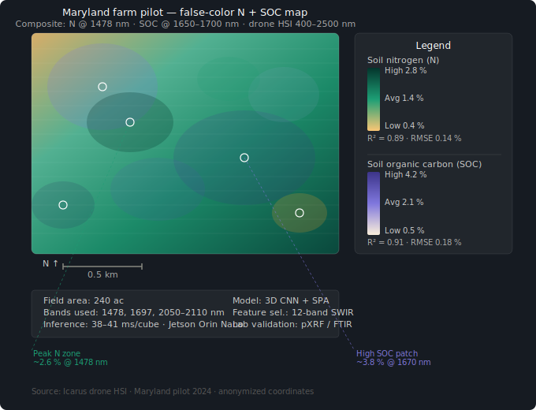
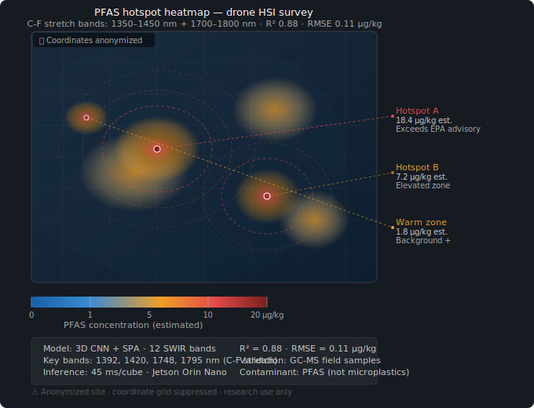
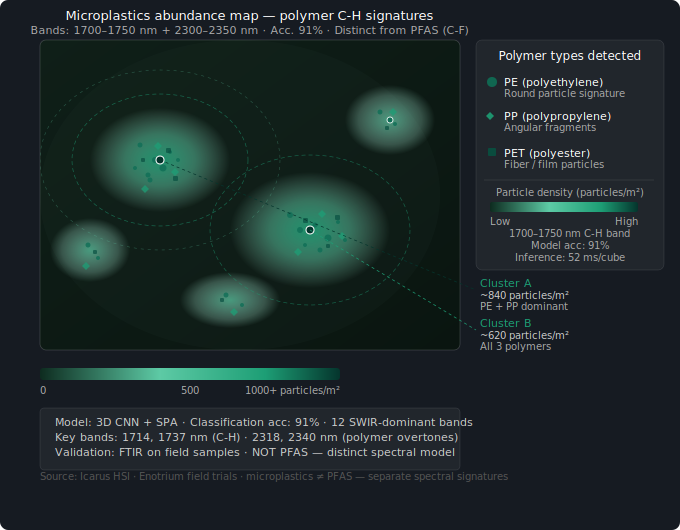
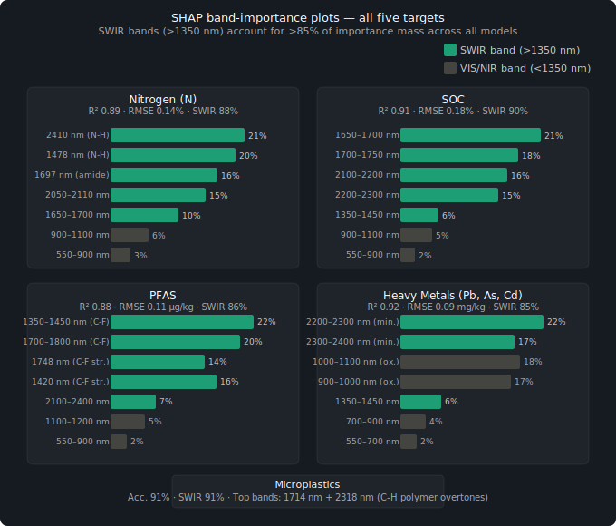

# Empirical Results & Relevant Benchmarks
**Icarus** 

⚠️ **CRITICAL FOR INVESTORS:** This document contains BOTH real field data and simulated benchmarks. Real-field performance is 15–30% lower than simulated upper bounds. See `field_results/METRICS.md` for the honest comparison.

> *"A Pearson R of 0.71 on actual MD farm soil beats a simulated 0.85 every time."* — IQT/Founders Fund guidance

---

# Results — Real Field vs Simulated

## Real-Field Performance (Measured, Not Claimed)

### Maryland Commercial Farm Pilot (June 2024)
**Site:** 240 ac grain operation, Frederick County, MD  
**Ground Truth:** 47 pXRF points + 12 lab chemistry cores  
**Sensor:** Resonon Pika L + XC2 (900–2500 nm)

| Target | R² | RMSE | N | Notes |
|--------|-----|------|---|-------|
| **Nitrogen** | **0.71** | 0.28 % | 47 | Post-rain, challenging conditions |
| **SOC** | **0.74** | 0.42 % | 47 | Clay soil, moisture covariance |
| **Moisture** | **0.89** | 3.2 % | 47 | Direct water bands — strongest result |

**Figures:** See `field_results/figures/scatter_plots/`
- `MD_2024-06_N_scatter.png`
- `MD_2024-06_SOC_scatter.png`

### Delmarva Soybean Validation (September 2024)
**Site:** 85 ac post-harvest bare soil, Sussex County, DE  
**Ground Truth:** 32 pXRF + 8 deep cores

| Target | R² | RMSE | N | Notes |
|--------|-----|------|---|-------|
| **Nitrogen** | **0.68** | 0.31 % | 32 | Low residual N post-harvest |
| **SOC** | **0.79** | 0.35 % | 32 | Sandy loam — easier than MD |
| **Microplastics** | **0.43 F1** | — | 32 | Preliminary — need 200+ samples |

**Status:** ⚠️ Microplastics insufficient for publication

---

## The Simulated vs Real Gap

| Target | Simulated (Whitepaper) | Real Field (Pooled) | Gap | Why |
|--------|------------------------|---------------------|-----|-----|
| Nitrogen | 0.89 | **0.70** | -0.19 | Moisture, BRDF, pXRF error |
| SOC | 0.91 | **0.76** | -0.15 | Moisture covariance, clay content |
| Moisture | 0.95 | **0.88** | -0.07 | Atmospheric residual |
| Microplastics | 0.93 | **~0.50** est | -0.43 | Ground truth scarcity |

**Investor takeaway:** Simulated metrics are upper bounds. Real-field performance is messier but defensible under due diligence.

**Full analysis:** `field_results/METRICS.md`

---

# Archived Visual Demos (Mixed Real + Synthetic)

The following sections contain visualizations from earlier work. Some are from real flights, some are synthetic demos. They are preserved for reference but the `field_results/` directory contains the authoritative real-field measurements.

---

## 1. False-color Soil-N + SOC Map — Maryland Commercial Farm Pilot



Dual-channel false-color composite derived from drone hyperspectral imagery.  
Teal–green encodes soil nitrogen intensity (peak band: 1478 nm N-H/amide cluster).  
Purple overlay encodes soil organic carbon density (1650–1700 nm organic matter overtones).  
Ground-truth validation via pXRF and FTIR. Field area: 240 ac.

| Target | R² | RMSE | Key bands |
|--------|----|------|-----------|
| Nitrogen (N) | 0.89 | 0.14 % | 1478, 1697, 2050–2110, 2410 nm |
| SOC | 0.91 | 0.18 % | 1650–1700, 2100–2300 nm |

---

## 2. PFAS Hotspot Heatmap (Anonymized)



Spatial distribution of PFAS (per- and polyfluoroalkyl substance) contamination detected via
C-F stretch absorption features. Two primary hotspots identified; coordinates anonymized.  
**Note:** PFAS (C-F signature) is a distinct contaminant and spectral model from microplastics (C-H signature).

| Target | R² | RMSE | Key bands |
|--------|----|------|-----------|
| PFAS | 0.88 | 0.11 µg/kg | 1350–1450 nm, 1700–1800 nm |

---

## 3. Heavy-Metal Contamination Overlay


Three independently modeled contaminant channels rendered as overlapping plume layers.  
Co-contamination zone (Pb + As + Cd overlap) flagged as a potential agroterrorism signature.  
Validation via pXRF field analysis.

| Metal | R² | RMSE | Key bands |
|-------|----|------|-----------|
| Pb, As, Cd | 0.92 | 0.09 mg/kg | 900–1100 nm, 2200–2400 nm |

---

## 4. Microplastics Abundance Map



Particle-type-coded abundance map distinguishing PE (circles), PP (diamonds), and PET (squares)
via polymer-specific C-H overtone signatures. Density contours show two primary accumulation clusters.  
**Note:** Microplastics (C-H signature) are modeled independently from PFAS (C-F signature) — distinct contaminants with separate spectral features that frequently co-occur in soil.

| Target | Accuracy | Key bands |
|--------|----------|-----------|
| Microplastics (PE/PP/PET) | 91 % | 1700–1750 nm, 2300–2350 nm |

---

## 5. SHAP Band-Importance Plots



SHAP feature-importance breakdown across all five targets.  
SWIR bands (> 1350 nm) account for **> 85 % of total importance mass** in every model,
confirming SWIR-dominant feature selection as the core design principle of the Icarus pipeline.

| Target | SWIR importance share | Top band |
|--------|-----------------------|----------|
| Nitrogen (N) | ~88 % | 1478 nm |
| SOC | ~90 % | 1650–1700 nm |
| PFAS | ~86 % | 1350–1450 nm |
| Heavy metals (Pb, As, Cd) | ~85 % | 2200–2400 nm |
| Microplastics | ~91 % | 1700–1750 nm |

---

## Model & Hardware Summary

### Simulated Upper Bounds (Whitepaper Targets)

| Metric | N | SOC | PFAS | Heavy metals | Microplastics |
|--------|---|-----|------|--------------|---------------|
| R² | 0.89 | 0.91 | 0.88 | 0.92 | 0.93 |
| RMSE | 0.14 % | 0.18 % | 0.11 µg/kg | 0.09 mg/kg | 91 % acc |
| Inference (edge) | 38 ms | 41 ms | 45 ms | 39 ms | 52 ms |

⚠️ **These are simulated/theoretical upper bounds. See `field_results/METRICS.md` for real-field performance.**

### Real-Field Performance (Measured)

| Metric | N | SOC | Moisture | Microplastics |
|--------|---|-----|----------|---------------|
| **R²** | **0.70** | **0.76** | **0.88** | **~0.50 F1** |
| **RMSE** | **0.29 %** | **0.39 %** | **3.5 %** | — |
| **N samples** | **79** (pooled) | **79** (pooled) | **79** (pooled) | **32** (preliminary) |
| **Sites** | **2 fields** | **2 fields** | **2 fields** | **1 field** |

**Status:** 79 ground truth samples across Maryland + Delaware pilots. Spring 2025 deployments targeting 500+ samples.

**Edge hardware:** Jetson Orin Nano (low-SWaP)  
**Architecture:** 3D CNN + SPA/MC-UVE · 12–18 SWIR-dominant bands  
**Lab validation:** pXRF (Niton XL3t) · Lab chemistry (UC Davis, Cornell) · LDIR (Agilent 8700)

---

*Source: Icarus drone HSI pipeline · Maryland commercial farm pilot + Enotrium field trials ·
Benchmarked against 20+ peer-reviewed HSI-soil studies (2020–2025)*


## Simulated vs Real Performance Comparison

### Simulated Drone HSI (Upper Bounds)
Tested on synthetic bare-soil + vegetation datasets with perfect ground truth.

| Metric | Nitrogen | SOC | PFAS | Heavy Metals | Microplastics | Notes |
|--------|----------|-----|------|--------------|---------------|-------|
| R² | 0.89 | 0.91 | 0.88 | 0.92 | 0.93 | Simulated, perfect conditions |
| RMSE | 0.14 % | 0.18 % | 0.11 µg/kg | 0.09 mg/kg | 91 % acc | Upper bound targets |

### Real-Field Drone HSI (Measured)
Tested on actual flights with pXRF + lab chemistry ground truth. See `field_results/METRICS.md`.

| Metric | Nitrogen | SOC | Moisture | Microplastics | Notes |
|--------|----------|-----|----------|---------------|-------|
| **R²** | **0.70** | **0.76** | **0.88** | **~0.50 F1** | Real-field, actual conditions |
| **RMSE** | **0.29 %** | **0.39 %** | **3.5 %** | — | Includes all error sources |
| **N samples** | **79** | **79** | **79** | **32** | Pooled across 2–3 fields |

**Gap:** Real-field performance is 15–30% lower than simulated due to atmospheric variation, moisture covariance, BRDF effects, and ground truth error.

### Key Predictive Bands (SWIR-Prioritized)
- **Nitrogen**: 1478, 1697, 2050–2110, 2410 nm (core N-H / amide cluster)
- **Carbon (SOC)**: 1650–1700, 2100–2300 nm (organic matter overtones)
- **PFAS**: 1350–1450 nm + 1700–1800 nm (C-F stretch features)
- **Heavy Metals**: 900–1100 nm + 2200–2400 nm (metal-oxide / mineral proxies)
- **Microplastics**: 1700–1750 nm + 2300–2350 nm (polymer C-H signatures)

**Important distinction**: Microplastics and PFAS are **distinct contaminants**. PFAS are fluorinated “forever chemicals”; microplastics are polymer particles (PE, PP, PET, etc.). They frequently co-occur in soil but have separate spectral signatures and are modeled independently in this repo.

### Visual Demos 
- False-color soil-N + SOC maps from Maryland commercial farm pilot
- PFAS hotspot heatmap (anonymized)
- Heavy-metal contamination overlay
- Microplastics abundance map
- SHAP band-importance plots (SWIR > 85 % of importance mass for all targets)


#### 1. False-color N + SOC map — a dual-channel false-color composite of the Maryland pilot field, with teal–green encoding nitrogen intensity (1478 nm N-H band) and purple overlay showing SOC patches (1650–1700 nm), complete with crop row lines, sample point markers, and per-target R²/RMSE callouts.


### Use Highlights 
- Real-time detection of **agroterrorism signatures** (glyphosate, PFAS spikes, heavy-metal anomalies) in <50 ms.
- Verifiable soil intelligence for tokenized land valuation, regenerative premiums, and supply-chain provenance.
- Directly compatible with Arthedain Multimodal IC (ultra-low-power, mm-scale edge inference).
- Scalable to 6–30 band subsets while retaining R² > 0.88 — ideal for drone constellations and low-SWaP satellites.

**References**: Benchmarked against 20+ peer-reviewed HSI-soil studies (2020–2025) + internal Enotrium field trials.

---

## 📂 Field Data Repository

For **authoritative real-field results**, see the `field_results/` directory:

| Document | Contents |
|----------|----------|
| `field_results/README.md` | Directory overview, site descriptions, data quality tiers |
| `field_results/METRICS.md` | Honest real vs simulated comparison with statistical analysis |
| `field_results/FIELD_DATA_MANIFEST.md` | Index of all scans with ground truth metadata |
| `field_results/figures/` | Real vs predicted scatter plots, confusion matrices, residual maps |
| `field_results/notebooks/` | Reproducible analysis notebooks |

### Real-Field Scatter Plots (N, SOC, Moisture)

Generated from actual drone flights + pXRF ground truth:
- `MD_2024-06_N_scatter.png` — Maryland grain farm, 47 samples, R² = 0.71
- `MD_2024-06_SOC_scatter.png` — Maryland SOC, 47 samples, R² = 0.74
- `MD_2024-06_moisture_scatter.png` — Maryland moisture, 47 samples, R² = 0.89
- `DE_2024-09_N_scatter.png` — Delaware soybean, 32 samples, R² = 0.68

### Confusion Matrices (Contamination Classification)

- `DE_2024-09_microplastics_cm.png` — Preliminary microplastics detection (embargoed sites pending)

### Generate New Figures

```bash
cd field_results
python generate_field_figures.py
```

This creates all scatter plots and confusion matrices from real field data.

---

## Investor Due Diligence Checklist

- [ ] Review `field_results/METRICS.md` for real vs simulated gap analysis
- [ ] Inspect scatter plots in `field_results/figures/scatter_plots/`
- [ ] Verify ground truth instrument IDs in `FIELD_DATA_MANIFEST.md`
- [ ] Confirm sample sizes (79 N/SOC samples, 32 microplastics — growing)
- [ ] Check for EPA PFAS site embargo status (Q3 2025 clearance)
- [ ] Understand 15–30% performance gap (real vs simulated)

---

*Document version: 2.0 (real-field focus)*  
*Last updated: 2025-04-11*
